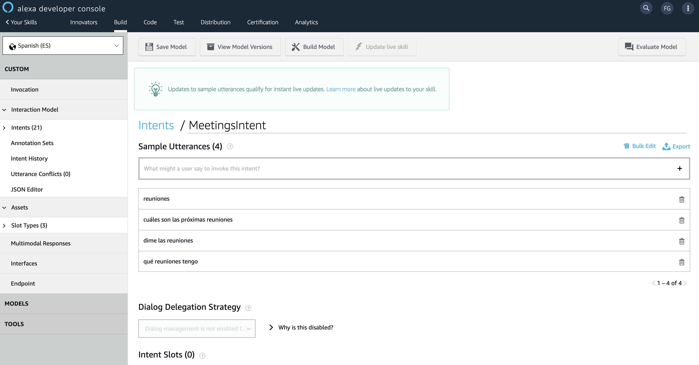
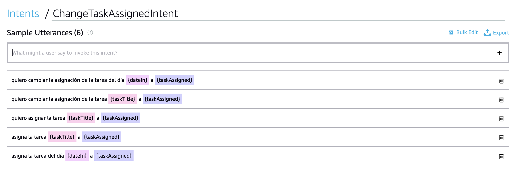
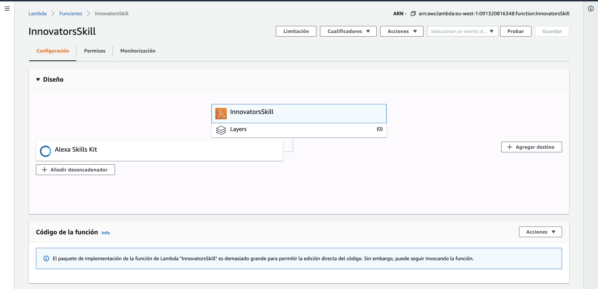
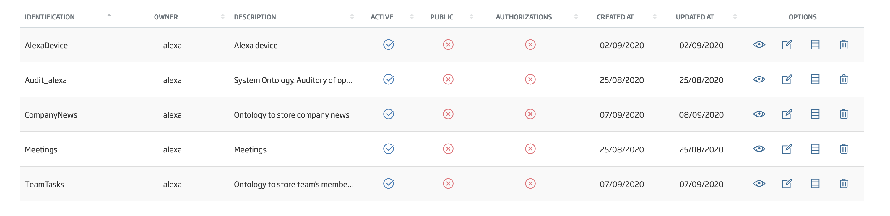
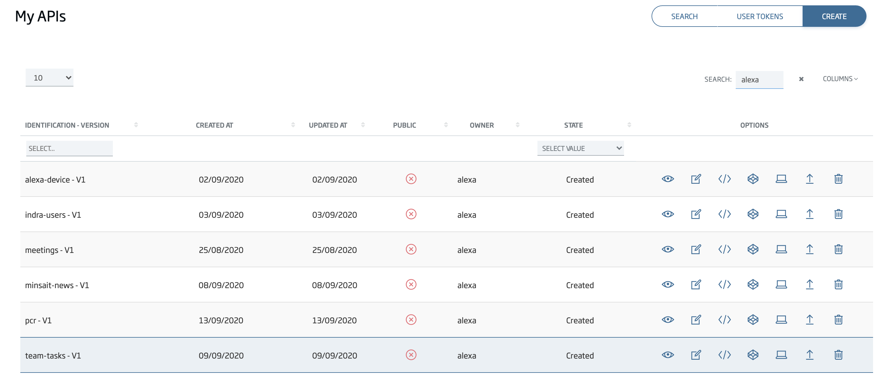
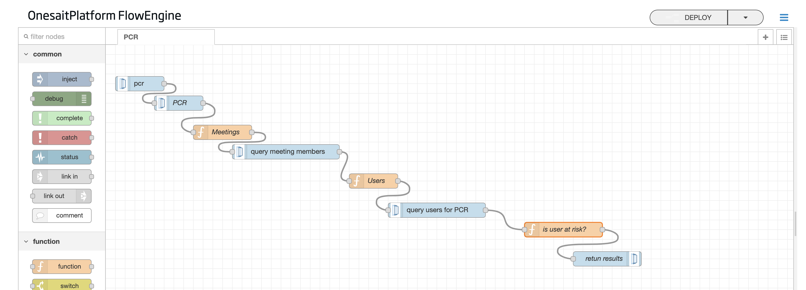
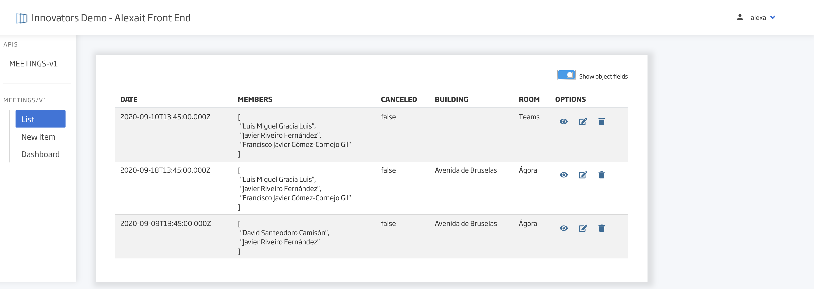

# Innovators-Alexait

Asistente/Skill Alexa para mejorar comunicación de empresa con empleados en tiempos post-pandemia

La solución se ofrece como una solución/herramienta que se vendería y parametrizaría a otras empresas para que estas puedan ofrecer la solución a sus empleados.
Está diseñada para permitir una comunicación más cómoda y efectiva del empleado con la empresa. Puede ser extendida para añadir nuevas funcionalidades en el futuro.

Está solución consta de dos elementos diferenciados:

* Una Skill compatible con cualquiera de los asistentes virtuales Alexa, que permita al empleado comunicarse con su equipo y la organización.
* Una aplicación construida sobre Onesait Platform, encargada de la integración con los sistemas de la organización a la que se vende la solución, y que sirve como punto de interconexión para la Skill de Alexa.

Y cubre los siguientes requisitos funcionales:

* Gestión de Reuniones: listar y cancelar próximas reuniones.
* Noticias: listar últimas noticias de la empresa.
* Gestión de tareas: listar, crear, reasignar y modificar tareas del equipo de trabajo.
* Buzón de soporte: integración con herramienta de ticketing, para información sobre nuevos tickets, asignación…
* Información covid-19: información sobre existencia de positivos en el entorno del empleado.

# Desarrollo de la Skill de Alexa

La Skill ha sido desarrollada en Java 8, y se ha hecho uso tanto de las herramientas de desarrollador de Alexa de Amazon, como de las Lambdas del mismo proveedor.

## Desarrollo del modelo de voz <em>Utterances</em> e <em>Intents</em>

Desde las herramientas de desarrollador se construye un modelo que Alexa es capaz de interpretar, y que permite hacer un mapeo entre órdenes emitidas por un usuario, y la funcionalidad de la Skill.

Aquí se han definido todas las <em>utterances</em> (sentencias ejemplo) de Alexa para ser mapeadas con los <em>Intents</em> (funciones de la Skill) desarrollados en la Skill.

Han sido definidos y mapeados un total de 21 intents para esta Skill. El modelo completo se encuentra en la carpeta <strong>src/main/resources/model.json</strong>

## Desarrollo de la Skill en Java

En la parte de código de Java, se desarrolla la funcionalidad que manejará uno o varios <em>Intents</em>. Contamos con un total de 14 <em>Intent Handlers</em>:

* <em>CurrentUserInterceptor</em>: lógica que se ejecuta al inicio de cada sesión, para identificar unívocamente al usuario y su dispositivo.
* <em>LaunchRequestHandler</em>: lógica de inicio de la Skill.
* <em>HelpIntentHandler</em>: ofrecer diálogo de ayuda al usuario.
* <em>FallbackIntentHandler</em>: lógica de <em>fallback</em>, si Alexa no entiende la orden.
* <em>CancelandStopIntentHandler</em>: lógica para detener la ejecución de la Skill.
* <em>MeetingsIntentHandler</em>: lógica de próximas reuniones.
* <em>NextMeetingIntentHandler</em>: lógica de próxima reunión.
* <em>CancelMeetingIntentHandler</em>: lógica para cancelar reuniones.
* <em>NewsIntentHandler</em>: lógica para mostrar noticias.
* <em>TaskIntentHandler</em>: lógica de listado de tareas de usuario.
* <em>ChangeTaskStateIntentHandler</em>: lógica para cambiar de estado una tarea de un usuario.
* <em>CreateTaskIntentHandler</em>: lógica para crear una tarea en el equipo.
* <em>FreshdeskIntentHandler</em>: lógica integración directa con buzón de soporte(ticketing) del equipo: conteo y listado de tickets.
* <em>PCRIntentHandler</em>: lógica que procesa si un usuario ha estado en contacto con algún positivo.

Todos estos <em>handlers</em> hacen uso de servicios Java que se comunican con la plataforma, a través de APIs REST.

* <em>DeviceManagementService</em>: registro (primer uso) y gestión de usuario de dispositivo Alexa.
* <em>FreshdeskService</em>: gestión del buzón de soporte. Integración directa (no onesait platform)
* <em>MeetingsService</em>: gestión de reuniones.
* <em>NewsService</em>: gestión de notiicas.
* <em>PCRService</em>: gestión de positivos PCR.
* <em>TaskService</em>: gestión de tareas.

## Despliegue de la Skill en Amazon Lambda

El código Java es empaquetado y desplegado desde la consola de Amazon Lambda. Desde ahí se disponibiliza a Alexa a través de un ID único: <em>amzn1.ask.skill.3c28c8f1-8d4d-43fb-b504-883cecd82304</em>

## Desarrollo del Back End de la Skill con onesait Platform

La mayor parte de la lógica de negocio se ha delegado en la platforma onesait, dejando la Skill en Java como un mero gateway, capaz de interpretar las órdenes del usuario y traducirlas a código.

Se ha hecho el desarrollo en el entorno público y gratuito https://lab.onesaitplatform.com

### Persistencia

Para la persistencia se han utilizado las ontologías siguientes:

* <em>AlexaDevice</em>: usuarios y dispositivos.
* <em>CompanyNews</em>: últimas noticias de la empresa.
* <em>Meetings</em>: reuniones.
* <em>TeamTasks</em>: tareas de los usuarios (dentro de un equipo de trabajo).

Cada una de estas ontologías contiene los campos necesarios para trabajar en código.

### APIficación REST

Las ontologías anteriores han sido APIficadas para poder ser usadas desde la Skill.

### Proceso de negocio en Flow Engine

La API que ejecuta la lógica de negocio para información sobre usuarios en contacto con otros positivos ha sido desarrollada con el Flow Engine.

Este proceso recibe un usuario como entrada, luego busca otros usuarios que hayan estado en contacto con éste. Si alguno ha dado positivo a la PCR en los últimos 14 días, se le notifica.

### Portal Front para reuniones

Se ha desarrollado un pequeño Front en React JS para la demo, para gestionar reuniones (crear reuniones, cambiarlas...), ya que no se tenía acceso a la integración con el sistema real de reuniones de la empresa.

El frontal esta disponible en https://lab.onesaitplatform.com/web/demo-innovators/ y el código compilado en el directorio /front-end. Se ha de iniciar sesión con el usuario creado para innovators, alexa.

